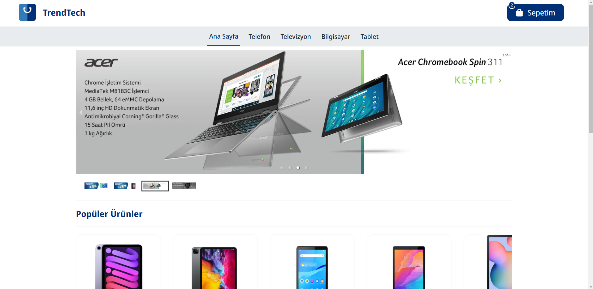
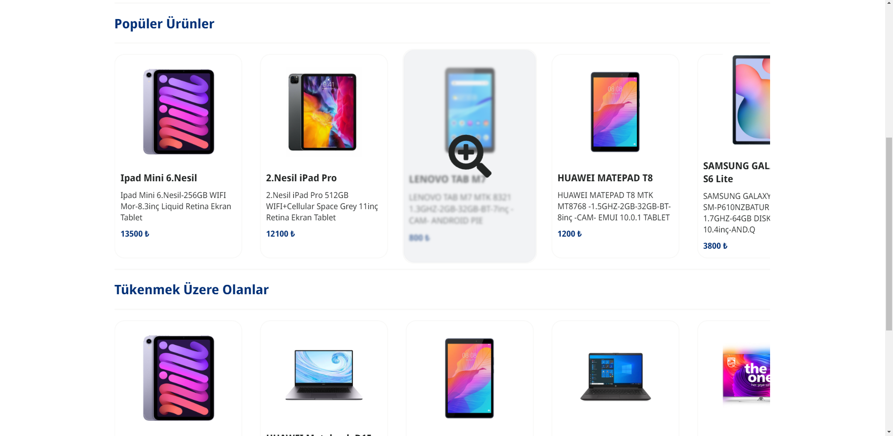
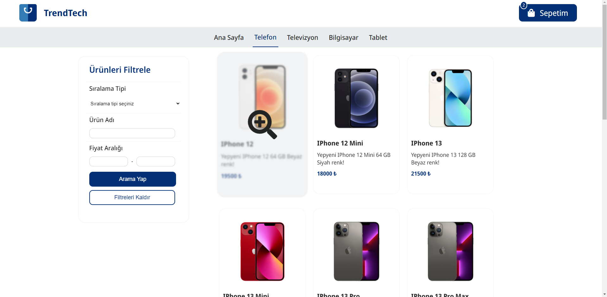
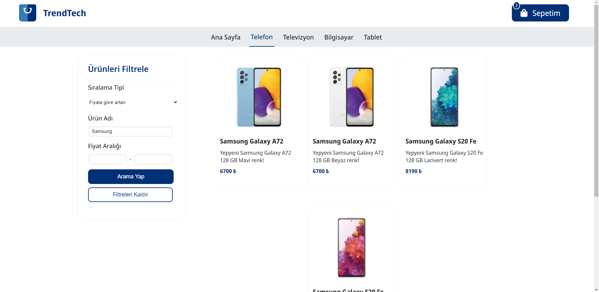
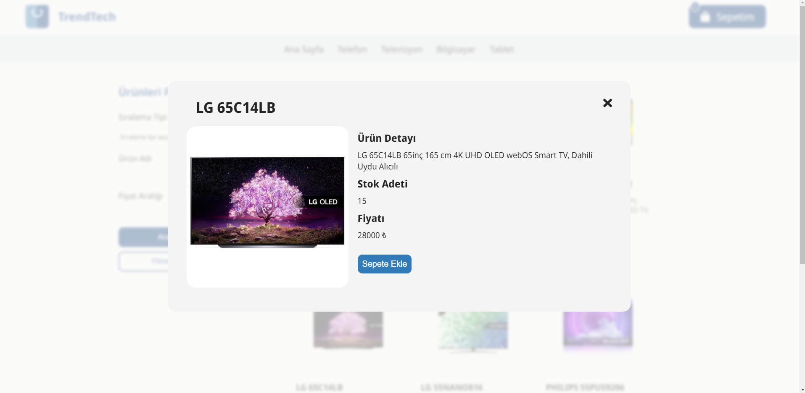
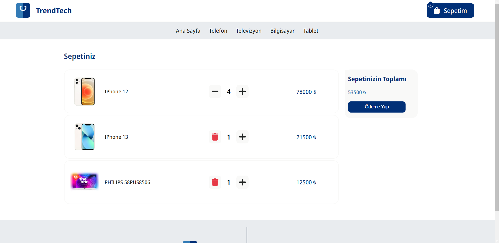
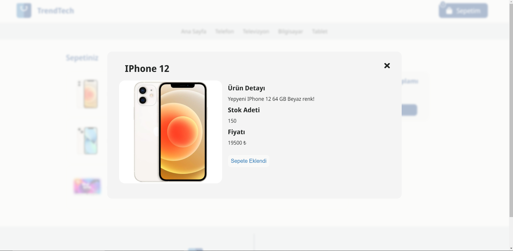

# ⚛️ ECommerce Frontend Project

### Install
   ```bash
   npm install
   ```

### Start
   ```bash
   npm start
   ```

# 🧰 Technologies

<ul style="list-style-type:disc">
   <li><a href="https://www.typescriptlang.org/">TypeScript</a></li>
   <li><a href="https://reactrouter.com/web/guides/quick-start">React Router</a></li>
   <li><a href="https://redux-toolkit.js.org/">Redux Toolkit</a></li>
   <li><a href="https://reactjs.org/docs/context.html">Context API</a></li>
   <li><a href="https://react-hook-form.com/">React Hook Form</a></li>
   <li><a href="https://github.com/jquense/yup">YupJS</a></li>
   <li><a href="https://sass-lang.com/guide">SCSS</a></li>
   <li><a href="https://usehooks.com/">React Custom Hooks (useLocaleStorage)</a></li>
   <li><a href="https://www.framer.com/docs/">Framer Motion</a></li>
   <li><a href="https://trendyol.github.io/react-carousel/docs/swipible/">Trendyol React Carousel</a></li>
</ul>

# 🎞 Projeden Görüntüler









# 📌 Todos

- [ ] Add payment section
- [ ] Add order section